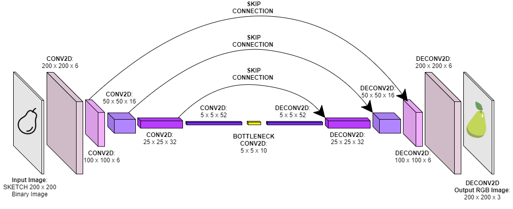

# Sketch2Fruits
Turning your sketches into pictures of fruits

 
This project aims to develop a model based on convolutional networks, capable of transforming the minimalist sketch of a fruit into a realistic image with appropriate colors and textures.  

There are two main parts within the project:
* A jupyter notebook `Sketch2Fruits.ipynb` with following pipeline:
    1. Data Loading
    2. Data Preprocessing using OpenCV functions
    3. Data Augmentation
    4. Keras model building and training
    5. Result Visualization
    6. Model saving
* A python script `draw_your_own.py` which enables a canvas interface with tkinter in order to test the model with live drawing.

The network architecture that best fits the data is the following:

